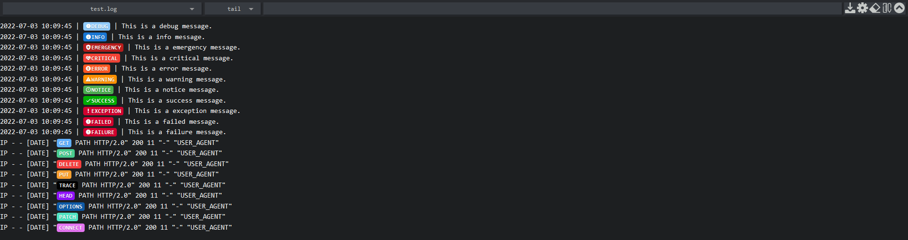

# Tailon [](https://github.com/NiNiyas/tailon/blob/master/LICENSE) [](https://github.com/NiNiyas/tailon/releases)

<p align="center">
  
</p>

Fork of [gvalkov/tailon](https://github.com/gvalkov/tailon).

Tailon is a webapp for looking at and searching through files and streams. \
In a nutshell, it is a fancy web wrapper around the following commands:

```
tail -f
tail -f | grep
tail -f | awk
tail -f | sed
```

What sets tailon apart from other similar projects is:

* Fully self-contained executable. Just download (or build) and run.
* Responsive and minimal user-interface.

## Install

### Docker
#### docker run

```
docker run --rm ghcr.io/niniyas/tailon:beta --help
```

#### docker compose
```
version: "3.9"
services:
  tailon:
    container_name: Tailon
    image: ghcr.io/niniyas/tailon:beta
    ports:
      - 8080:8080
    volumes:
      - /var/log/syslog:/syslog
      - /var/log/log1:/log1
      - .tailon/config:/config  # If you need to load from config file, put your config.toml in this folder.
    command: -b :8080 "group=Syslog,alias=syslog,/syslog" "group=group1,/log1/*.log"
    command: -c /config/config.toml # If you need to load from config file
```

### Releases

Download a build for your platform from the [releases](https://github.com/NiNiyas/tailon/releases) page.

## Changelog

See [changelog](CHANGELOG.md).

## Usage

Tailon is a command-line program that starts a local HTTP server, which in turn streams the output of commands such as `tail` and `grep`. \
It can be configured from its command-line interface or through the convenience of a [toml](https://github.com/toml-lang/toml) config file. \
Some options, like adding new commands, are only available through the configuration file.

To get started, run tailon with the list of files that you wish to monitor.

```
tailon /var/log/apache/access.log /var/log/apache/error.log /var/log/messages
```

Tailon can serve single files, globs or whole directory trees. \
Tailon’s server-side functionality is summarized entirely in its help message:

[//]: # (run "make README.md" to update the next section with the output of tailon --help)

[//]: # (BEGIN HELP)
```
Usage: tailon -c <config file>
Usage: tailon [options] <filespec> [<filespec> ...]

Tailon is a webapp for looking at and searching through files and streams.

  -a, --allow-download         Allow file downloads. (default true)
  -b, --bind string            Listen on the specified address and port (default ":8080")
  -c, --config string          Config.toml file location.
  -h, --help                   Show this help message and exit
  -e, --help-config            Show configuration file help and exit
      --history-lines int      No. of history lines to tail.
      --lines-to-tail int      No. of lines to tail. (default 100)
  -r, --relative-root string   Webapp relative root. (default "/")

Tailon can be configured through a config file or with command-line flags.

The command-line interface expects one or more filespec arguments, which
specify the files to be served. The expected format is:

  [alias=name,group=name]<spec>

where <spec> can be a file name, glob or directory. The optional 'alias='
and 'group=' specifiers change the display name of the files in the UI and
the group in which they appear.

A file specifier points to a single, possibly non-existent file. The file
name in the UI can be overwritten with 'alias='. For example:

  tailon alias=error.log,/var/log/apache/error.log

A glob evaluates to the list of files that match a shell file name pattern.
The pattern is evaluated each time the file list is refreshed. An 'alias='
specifier overwrites the parent directory of each matched file in the UI.

  tailon "/var/log/apache/*.log" "alias=nginx,/var/log/nginx/*.log"

If a directory is given, all files under it are served recursively.

  tailon /var/log/apache/ /var/log/nginx/

Example usage:
  tailon file1.txt file2.txt file3.txt
  tailon alias=messages,/var/log/messages "/var/log/*.log"
  tailon -b localhost:8080,localhost:8081 -c config.toml

For information on usage through the configuration file, please refer to the
'--help-config' option.
```
[//]: # (END HELP)

### Config File
Tailon can be configured through a TOML config file. \
The config file allows more configurability than the command-line interface.

```
  # The <title> of the index page.
  title = "Tailon"

  # The root of the web application.
  relative-root = "/"

  # The addresses to listen on. Can be an address:port combination or an unix socket.
  listen-addr = [":8080"]

  # Allow download of know files (only those matched by a filespec).
  allow-download = true

  # Commands that will appear in the UI.
  allow-commands = ["tail", "grep", "grep -v", "sed", "awk"]

  title = "Tailon"
  relative-root = "/"
  listen-addr = [":8080"]
  allow-download = true
  lines-of-history = 0
  lines-to-tail = 100
  allow-commands = ["tail", "grep", "grep -v", "sed", "awk"]

  [files]
    file1 = "alias=test,group=test_group,log.log"
    file2 = "alias=test1,group=test_group1,log.log"

  [commands]
    [commands.tail]
    action = ["tail", "-n", "$lines", "-F", "$path"]

    [commands.grep]
    stdin = "tail"
    action = ["grep", "-e", "$script"]
    default = ".*"

    [commands.sed]
    stdin = "tail"
    action = ["sed", "-u", "-e", "$script"]
    default = "s/.*/&/"

    [commands.awk]
    stdin = "tail"
    action = ["awk", "--sandbox", "$script"]
    default = "{print $0; fflush()}"

    [commands."grep -v"]
    stdin = "tail"
    action = ["grep", "-v", "--text", "--line-buffered", "--color=never", "-e", "$script"]
    default = "^$"
```

### Labels

Tailon will automatically convert the following to labels:

#### Log levels

- EMERGENCY
- ALERT
- CRITICAL
- ERROR
- WARNING
- WARN
- NOTICE
- INFO
- DEBUG

#### HTTP Methods

- GET
- POST
- PUT
- HEAD
- DELETE
- PATCH
- OPTIONS
- CONNECT
- TRACE

#### Others
- FAILED
- FAILURE

## Security

Tailon runs commands on the server it is installed on. While commands that
accept a script argument (such as awk, sed and grep) should be invulnerable to
shell injection, they may still allow for arbitrary command execution and
unrestricted access to the filesystem.

To clarify this point, consider the following input to the sed command:

```
s/a/b'; cat /etc/secrets
```

This will result in an error, as tailon does not invoke commands through a
shell. On the other hand, the following command is a perfectly valid sed script
that has the same effect as the above attempt for shell injection:

```
r /etc/secrets
```

The default set of enabled commands - tail, grep and awk - should be safe to
use. GNU awk is run in [sandbox](http://www.gnu.org/software/gawk/manual/html_node/Options.html#index-g_t_0040code_007b_002dS_007d-option-277) mode, which prevents scripts from accessing your
system, either through the `system()` builtin or by using input redirection.

By default, tailon is accessible to anyone who knows the server address and
port.


## Development

### Requirements

If you are on Windows, use WSL2. Install [Ubuntu](https://apps.microsoft.com/store/detail/ubuntu/9PDXGNCFSCZV) from Microsoft Store.

- GO: v1.18. I followed [this](https://www.digitalocean.com/community/tutorials/how-to-install-go-on-ubuntu-20-04) guide.
- Node.js: v16.*. I followed [this](https://github.com/nodesource/distributions/blob/master/README.md) guide.
- Make: `sudo apt-get install make`
- [entr](https://github.com/eradman/entr): `sudo apt-get install entr`


```
git clone https://github.com/NiNiyas/tailon.git
cd tailon
export GOROOT=/usr/local/go
export GOPATH=$HOME/go
export PATH=$PATH:$GOROOT/bin
go get
```

**Note**: The paths above might be different for you. Set this accordingly.

### Frontend

The web interface is a written in plain ES5 with the help of some Vue.js. A
simple makefile is used to bundle and compress the frontend assets. To work on
the frontend, make sure you're building with the `dev` build tag:

```
go build -tags dev
```

This will ensure that the `tailon` binary is reading assets from the
`frontend/dist` directory instead of from `frontend/assets_vfsdata.go`. To
compile the web assets, use `make all` or `make all BUILD=dev` in case you want
to simply concatenate files instead of also compressing them.

The `make watch` goal can be used to continuously update the bundles as you make
changes to the sources. This requires [entr](#requirements).

Note that the minified frontend bundles are committed in order to avoid people
wanting to work only on the backend from having to pull the full `node_modules`.

To build frontend, I have included a simple [build_frontend](https://github.com/NiNiyas/tailon/blob/master/build_frontend.sh) script. \
Make it executable with `sudo chmod +x build_frontend.sh` and run it `./build_frontend.sh`.

### Backend

The backend is written in straightforward go that tries to do as much as
possible using only the standard library.

#### Alpine Linux build

- INFO: http://krolow.com.br/til/go-compile-binary-not-running-in-alpine-and-busybox/

`CGO_ENABLED=0 go build -tags netgo -a -v`


## Backlog

See [TODO](TODO.md).

## Known Bugs

- When toolbar is hidden, last few lines are not visible in Fennec FDroid 101.1.1 build#1011120 8092b4e74+ and possibly other Firefox versions as well. Works fine on Bromite.

### Testing

The project has unit-tests, which you can run with `go test` and integration
tests which you can run with `cd tests; pytest`. \
Alternatively, you can run both with `make test`.

The integration tests are written in Python and use `pytest` and `aiohttp` to
interact with a running `tailon` instance. \
To run the integration tests, you first need to install the needed dependencies:

**Note**: Python testing is broken. I have commented out the line in [Makefile](Makefile), I will take a look at it when I have time.

```shell
# Option 1: Using a virtualenv
python3 -m venv path/to/venv
source path/to/venv/bin/activate
python3 -m pip install -r tests/requirements.txt

# Option 2: User site-packages
python3 -m pip install --user -r tests/requirements.txt
```

### Contribute

Please do contribute! Issues and pull requests are welcome. I could use some help.

<!--## What about the other tailon project?

This project is a full rewrite of the original [tailon](https://github.com/gvalkov/tailon-legacy) with the following goals in mind:

* Reduce maintenance overhead (especially on the frontend).
* Remove unwanted features and fix poor design choices.
* Learn more about Go and Vue.js.

In terms of tech, the following has changed:

* Backend from Python+Tornado to Go.
* Frontend from a very-custom Typescript solution to a simple ES5 + Vue.js app.
* Simplified asset pipeline (a short Makefile).
* Config file is now toml based.
* Fully self-contained executable.


## Similar Projects

* [clarity](https://github.com/tobi/clarity)
* [errorlog](http://www.psychogenic.com/en/products/Errorlog.php)
* [log.io](http://logio.org/)
* [rtail](http://rtail.org/)
* [tailon](https://github.com/gvalkov/tailon-legacy) -->
